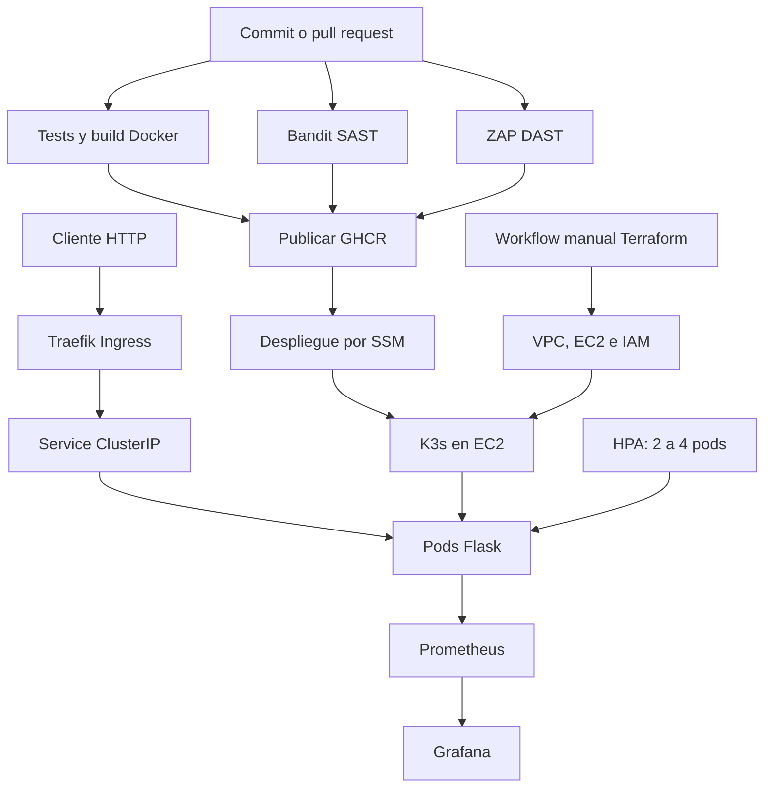

# Proyecto final DevOps: API Flask en AWS con CI/CD

**Autor:** Rodrigo Arrocha · **Curso:** DevOps, Coderhouse · **Entrega:** 3 de octubre de 2026.

API de demostración que integra Docker, Terraform, GitHub Actions, GHCR, Kubernetes (K3s), Bandit, OWASP ZAP, Prometheus y Grafana. El pipeline valida cada cambio, publica una imagen identificada por el SHA del commit y la despliega en AWS mediante Systems Manager (SSM).

- [Repositorio](https://github.com/Rodri93ax/proyecto-final-coderhouse)
- [Ejecuciones de GitHub Actions](https://github.com/Rodri93ax/proyecto-final-coderhouse/actions)
- [Guía de preparación de AWS y GitHub](docs/reproduccion-aws.md)
- [Índice de evidencias](docs/evidencias/INDICE.md)
- [Informe de entrega](docs/PFArrocha.pdf)

## 1. Arquitectura y alcance



Entorno de laboratorio de **un nodo**, en `us-east-1`: EC2 `t3.large`, Ubuntu 24.04, disco raíz gp3 cifrado de 30 GiB. VPC `10.42.0.0/16`, subred pública `10.42.1.0/24`, red de pods `10.52.0.0/16` y red de servicios `10.43.0.0/16`. Separar estos rangos evita solapamientos.

El provisionamiento se ejecuta bajo demanda con los workflows Terraform. La aplicación se publica y despliega automáticamente después de aprobar los controles en `main`. En pull requests se ejecutan los controles, sin publicación ni despliegue. El monitoreo se instala mediante el script versionado; no forma parte del job de despliegue de la API.

## 2. Archivos principales

| Ruta | Función |
|---|---|
| `app.py`, `tests/`, `requirements.txt` | API, cinco tests y dependencias fijadas |
| `Dockerfile`, `.dockerignore` | Construcción multi-stage y contexto de build |
| `infra/modules/network/` | VPC, subred, Internet Gateway y rutas |
| `infra/modules/compute/` | EC2, SSH, seguridad, IAM de SSM y bootstrap K3s |
| `infra/backend.tf`, `.terraform.lock.hcl` | Estado remoto S3 y versión bloqueada del provider |
| `.github/workflows/ci.yml` | Tests, Docker, SAST, DAST, publicación y despliegue |
| `.github/workflows/terraform-{plan,apply}.yml` | Validación y gestión de infraestructura |
| `.github/workflows/aws-identity.yml` | Comprobación de OIDC y acceso al estado |
| `k8s/app.yaml` | Namespace, Deployment, Service, Ingress y HPA |
| `monitoring/`, `scripts/` | Helm values, PodMonitor, dashboard y tráfico |
| `security/check_zap.py` | Política de aceptación de alertas DAST |
| `docs/evidencias/` | Logs, informes ZAP y capturas |

## 3. Ejecutar localmente

Requisitos: Git, Python 3.14 con `venv` y Docker Engine para la prueba con contenedores. Los comandos siguientes se ejecutan en una terminal Linux desde la raíz del repositorio.

```bash
git clone https://github.com/Rodri93ax/proyecto-final-coderhouse.git
cd proyecto-final-coderhouse
python3.14 -m venv .venv
source .venv/bin/activate
python -m pip install -r requirements.txt
python -m unittest discover -s tests -v
python -m flask --app app run --host 127.0.0.1 --port 8000
```

En otra terminal:

```bash
curl -fsS http://127.0.0.1:8000/
curl -fsS http://127.0.0.1:8000/health
curl -fsS http://127.0.0.1:8000/metrics
```

Resultados esperados: `/` devuelve datos del proyecto; `/health` devuelve `{"status":"ok"}`; `/metrics` expone métricas Prometheus. Una ruta inexistente devuelve 404. Flask en este comando es solo para desarrollo; el contenedor utiliza Gunicorn.

### Prueba con Docker

```bash
docker build -t coderhouse-api:local .
docker run -d --name coderhouse-api-local \
  -p 127.0.0.1:8000:8000 coderhouse-api:local
curl --retry 12 --retry-all-errors --retry-delay 2 \
  --max-time 10 -fsS http://127.0.0.1:8000/health
docker inspect --format '{{.State.Health.Status}}' coderhouse-api-local
docker logs coderhouse-api-local
# Al finalizar:
docker rm -f coderhouse-api-local
```

Detener antes el servidor Flask si ocupa el puerto 8000. El healthcheck tarda unos segundos en pasar a `healthy`.

El Dockerfile usa dos etapas basadas en `python:3.14-slim`, instala dependencias en un entorno virtual sin caché de pip y copia únicamente el entorno y `app.py` al runtime. Ejecuta como UID/GID 10001 y Gunicorn con un worker y cuatro threads. El único worker conserva coherencia con el contador Prometheus en memoria; las réplicas se escalan con Kubernetes. La etiqueta base es mutable: no se afirma reproducibilidad binaria por digest.

## 4. Preparar AWS y Terraform

Para replicar en otra cuenta seguir primero [reproduccion-aws.md](docs/reproduccion-aws.md): bucket S3, identidad OIDC, permisos IAM y adaptación de identificadores. Esos prerrequisitos de bootstrap no son creados por los módulos Terraform de este repositorio.

Herramientas: Terraform **1.16.4** (rango declarado `>= 1.16.4, < 2.0.0`), AWS CLI v2 y credenciales de una identidad autorizada. El lockfile fija AWS provider **6.66.0** dentro del rango `~> 6.0`.

```bash
aws sts get-caller-identity
ssh-keygen -t ed25519 -f ~/.ssh/coderhouse-aws -C coderhouse-lab
cp infra/terraform.tfvars.example infra/terraform.tfvars
```

Usar un nombre de clave nuevo si ya existe; no sobrescribir una clave privada anterior. Editar `infra/terraform.tfvars`: `admin_cidr` debe ser la IPv4 pública del operador con `/32`, y `public_key_path` la ruta de su clave **pública**. No versionar credenciales, `terraform.tfvars`, estados, planes ni claves privadas.

**Importaciones históricas:** `infra/imports.tf` asocia tres recursos IAM existentes del laboratorio al estado. Ya fueron importados. Para el entorno original puede conservarse como historial. Para una cuenta/estado nuevo donde esos recursos no existen, desactivarlo antes de planificar:

```bash
mv infra/imports.tf infra/imports.tf.example
```

Terraform creará entonces los recursos declarados en `infra/modules/compute/iam.tf`. Si esos recursos ya existen en el nuevo entorno, adaptar los IDs e importarlos en lugar de duplicarlos. Desactivar bloques `import` no elimina los bloques `resource` ni los objetos ya administrados.

```bash
terraform -chdir=infra init -input=false -lockfile=readonly
terraform -chdir=infra validate
terraform -chdir=infra plan -out=tfplan
# Revisar las acciones y aplicar exclusivamente el plan revisado:
terraform -chdir=infra apply tfplan
terraform -chdir=infra output
```

La AMI está fijada a `ami-0045d7fc2ad003464`, propietario Canonical `099720109477`, en `us-east-1`. Otra región requiere seleccionar una AMI compatible y revisar el plan. El bootstrap instala K3s `v1.35.8+k3s1`, cifra sus secretos y espera `/readyz`.

Mantener la EC2 encendida al validar este laboratorio. Se observó que, estando detenida, el provider propuso reemplazarla por el atributo de IP pública. Al encenderla desapareció esa propuesta. **No aplicar un reemplazo inesperado:** el disco raíz tiene `delete_on_termination = true`. Los cambios en `user_data` también pueden reemplazar la instancia.

### Infraestructura desde GitHub Actions

En **Actions**, elegir `Terraform plan AWS` y `Run workflow` sobre `main`. Revisar el paso `Mostrar plan`. Para aplicar, ejecutar `Terraform apply AWS`; este genera su propio plan, inspecciona sus acciones y aplica ese mismo archivo. Bloquea eliminaciones y reemplazos, y serializa las ejecuciones de apply. No existe un workflow de destrucción automática.

La variable de repositorio `ADMIN_CIDR` alimenta Terraform. La clave pública para CI está en `infra/keys/coderhouse-aws.pub`. El acceso AWS usa OIDC; no requiere Access Keys permanentes en los secretos de GitHub.

## 5. Pipeline CI/CD y seguridad

| Job | Control / resultado |
|---|---|
| `tests` | `unittest discover`: endpoints, contador y cabeceras |
| `docker` | Construcción de la imagen Docker |
| `sast` | Bandit 1.9.4 sobre `app.py` y `tests/` |
| `dast` | API efímera local; ZAP Baseline para `/`, `/health`, `/metrics` |
| `publish` | Requiere los cuatro jobs; etiqueta GHCR con el SHA completo |
| `deploy` | Requiere publicación; OIDC, SSM, manifiestos, rollout y healthcheck |

ZAP se ejecuta con el digest guardado en `docs/evidencias/zap-inicial/imagen.txt`. Se guardan HTML, JSON, logs y códigos de salida como artifact `dast-<SHA>` durante 30 días. Los informes incluidos en el repositorio conservan evidencia más allá de esa retención.

La política en `security/check_zap.py` permite únicamente la alerta informativa `10049-1` (`Non-Storable Content`) de riesgo `0`, porque `Cache-Control: no-store` es intencional. Cualquier otra alerta bloquea la publicación. Un informe sin sitios o un error de ejecución también falla. El DAST es un baseline pasivo; no equivale a una auditoría completa ni a un escaneo de CVE de la imagen.

Remediaciones aplicadas: CSP restrictiva, `X-Content-Type-Options`, `Permissions-Policy`, `Cross-Origin-Resource-Policy` y política de caché. Los tests comprueban cabeceras en respuestas exitosas y 404. La evidencia pasó de **62 PASS / 5 WARN / 0 FAIL** a **66 PASS / 1 WARN / 0 FAIL**.

### Despliegue automático

La EC2 debe estar `running` y SSM `Online`. El job sustituye en memoria la imagen de `k8s/app.yaml` por `ghcr.io/rodri93ax/proyecto-final-coderhouse:<SHA del commit>`, transmite el manifiesto por SSM y ejecuta:

```bash
k3s kubectl apply -f <manifiesto-temporal>
k3s kubectl -n coderhouse rollout status deployment/coderhouse-api --timeout=300s
k3s kubectl -n coderhouse get deployment,pods,svc,ingress,hpa
curl -fsS --max-time 10 http://127.0.0.1/health
```

El `<manifiesto-temporal>` lo crea el workflow; no es un comando para pegar literalmente. Un fallo en SSM, rollout o salud marca el job como fallido. La captura `docs/evidencias/capturas/ci-cd-success.png` y `deploy-github-ssm.txt` muestran una ejecución completa exitosa.

En un fork cambiar la ruta GHCR en `IMAGE`, la imagen del manifiesto **y el patrón de sustitución de Python en el job deploy**. Cambiar también rol OIDC, cuenta, bucket e `INSTANCE_ID`. La imagen debe ser accesible para K3s; para el laboratorio se usa acceso público de lectura a GHCR. Un paquete privado requiere configurar autenticación de pull, que no está implementada aquí.

## 6. Validar Kubernetes

Abrir **AWS > EC2 > instancia > Conectar > Session Manager**. En la sesión `ssm-user` ejecutar cada comando por separado:

```bash
sudo systemctl is-active k3s
sudo k3s kubectl get nodes
sudo k3s kubectl -n coderhouse get deployment,pods,svc,ingress,hpa
sudo k3s kubectl -n coderhouse rollout status deployment/coderhouse-api --timeout=300s
sudo k3s kubectl -n coderhouse top pods
curl -fsS --max-time 10 http://127.0.0.1/health
```

Esperado: K3s `active`, nodo `Ready`, Deployment `2/2`, pods `Running`, HPA con CPU numérica y respuesta de salud `ok`. El servicio es ClusterIP y Traefik publica la aplicación en el puerto 80 del nodo. La dirección privada que muestra el Ingress no es la URL pública: consultar la IP de EC2 o el output Terraform.

El manifiesto define requests de 100m CPU y 128 MiB y límites de 500m y 256 MiB por pod. Incluye startup/readiness/liveness probes, ejecución no root, filesystem de solo lectura, eliminación de capacidades y un `emptyDir` para `/tmp`. El HPA mantiene entre 2 y 4 réplicas con CPU objetivo de 70% del request; utiliza las métricas de recursos de Kubernetes, no el contador HTTP de Prometheus.

Para despliegue manual inicial, clonar el repositorio en EC2 (instalar Git si falta), situarse en su raíz y elegir una imagen ya publicada:

```bash
sudo k3s kubectl apply -f k8s/app.yaml
sudo k3s kubectl -n coderhouse rollout status deployment/coderhouse-api --timeout=300s
```

La imagen fija del manifiesto es una versión histórica; para validar el commit actual usar el workflow, que la sustituye por su SHA.

## 7. Monitoreo y dashboard

En EC2, con Helm instalado y desde la raíz de una copia del repositorio:

```bash
helm version
bash scripts/install-monitoring.sh monitoring/values.yaml monitoring/api-podmonitor.yaml
sudo k3s kubectl apply -f monitoring/dashboard-configmap.json
sudo k3s kubectl -n monitoring get pods,pvc,svc
sudo k3s kubectl -n monitoring get podmonitor coderhouse-api
```

La instalación usa `kube-prometheus-stack` **91.4.0** y genera un Secret `grafana-admin` con contraseña aleatoria. Prometheus guarda 1 día / hasta 2 GB en PVC de 5 GiB; Grafana utiliza PVC de 1 GiB. Son volúmenes `local-path`, almacenados en el nodo, sin respaldo externo automático.

Para instalar Helm seguir su [guía oficial](https://helm.sh/docs/intro/install/). El script espera el binario `helm` disponible también para `sudo`.

### Acceso seguro desde la computadora del operador

En dos terminales de EC2, mantener los port-forward abiertos:

```bash
sudo k3s kubectl -n monitoring port-forward svc/monitoring-grafana 3000:80 --address 127.0.0.1
```

```bash
sudo k3s kubectl -n monitoring port-forward svc/monitoring-prometheus 9090:9090 --address 127.0.0.1
```

En una terminal de la computadora local, con la clave SSH privada y `ADMIN_CIDR` autorizado (reemplazar `IP_PUBLICA_ACTUAL`):

```bash
ssh -i ~/.ssh/coderhouse-aws -N \
  -L 3000:127.0.0.1:3000 -L 9090:127.0.0.1:9090 \
  ubuntu@IP_PUBLICA_ACTUAL
```

Abrir `http://localhost:3000` y `http://localhost:9090`. Una sesión SSM en el navegador por sí sola no crea un túnel al navegador local. Como alternativa, AWS CLI con Session Manager Plugin permite port forwarding SSM; ver la guía de AWS en `docs/reproduccion-aws.md`.

Recuperar la contraseña en una terminal privada de EC2:

```bash
sudo k3s kubectl -n monitoring get secret grafana-admin \
  -o jsonpath='{.data.admin-password}' | base64 -d
printf '\n'
```

Usuario `admin`. No guardar esa salida en logs ni capturas de entrega. Elegir el dashboard **Coderhouse - API en AWS** y la fuente Prometheus. Para generar actividad, desde una computadora con Bash/curl ejecutar `bash scripts/generate-traffic.sh http://IP_PUBLICA_ACTUAL`.

Consultas de comprobación en Prometheus:

```promql
sum(up{namespace="coderhouse",job="monitoring/coderhouse-api"})
sum(rate(app_requests_total{namespace="coderhouse",exported_endpoint!="health"}[5m]))
sum(increase(app_requests_total{namespace="coderhouse",exported_endpoint!="health"}[15m]))
```

`exported_endpoint` conserva la etiqueta de la aplicación tras su conflicto con la etiqueta `endpoint` del scrape. El dashboard excluye las sondas `/health`; el propio endpoint `/metrics` no incrementa el contador. `increase()` es una estimación temporal, por eso puede mostrar valores decimales como 96.1 aunque el script haya realizado 100 solicitudes.

## 8. HPA y FinOps

La prueba registrada usó 16 clientes durante 180 segundos: **81.443 solicitudes exitosas y 0 errores**. El HPA pasó de 2 a 4 réplicas y luego a 3 y 2. Consultar `hpa-carga.txt`, `hpa-prueba.txt`, `hpa-final.txt` y la captura de Grafana bajo carga. Es una prueba del laboratorio, no un benchmark general de capacidad.

Para observar otra prueba, mantener `sudo k3s kubectl -n coderhouse get hpa -w` en una terminal y ejecutar una carga controlada desde un cliente autorizado. El script de 100 solicitudes demuestra métricas; por sí solo no garantiza disparar el HPA. Esperar varios minutos tras retirar la carga antes de evaluar el descenso de réplicas.

Controles de costo: una única EC2; HPA limitado a cuatro pods; requests/limits; créditos CPU `standard`; monitoreo detallado EC2 desactivado; retención acotada de métricas; apagado manual al finalizar. **Reducir pods no reduce la tarifa de esa EC2.** El disco EBS y otros recursos persistentes pueden seguir generando cargos con la instancia detenida. No se implementó programación automática de encendido/apagado ni se cuantificó ahorro monetario.

Apagar con **EC2 > Estado de la instancia > Detener instancia**, después de completar los workflows. No usar `Terminate`. Al volver, iniciar EC2, esperar SSM Online/K3s Ready y consultar la IP pública nueva. No disparar un despliegue cuando esté detenida.

## 9. Problemas frecuentes y recuperación

| Síntoma | Comprobación / acción |
|---|---|
| OIDC denegado | Audiencia `sts.amazonaws.com`, subject exacto del repositorio y rama; consultar guía AWS |
| AccessDenied en Terraform | Revisar acción/recurso del mensaje y política del rol; no reemplazarla por AdministratorAccess |
| Plan propone reemplazo de EC2 | Encender instancia si estaba detenida y volver a planificar; revisar AMI y user_data |
| SSM no está Online | Perfil `coderhouse-ec2-ssm`, agente activo y salida HTTPS; consultar guía |
| ImagePullBackOff | Existencia del SHA en GHCR, visibilidad del paquete y acceso a Internet |
| Rollout falla | `kubectl describe pod`, eventos y logs del pod; verificar probes y recursos |
| HPA `<unknown>` | Esperar arranque; revisar `kubectl top pods` y Metrics Server |
| Grafana sin datos | Prometheus seleccionado, ventana temporal, PodMonitor y targets; generar tráfico |
| IP pública distinta | Actualizar URL/túnel; los reinicios con stop/start del laboratorio cambiaron la IP |

Rollback manual, si una versión previa está disponible:

```bash
sudo k3s kubectl -n coderhouse rollout history deployment/coderhouse-api
sudo k3s kubectl -n coderhouse rollout undo deployment/coderhouse-api
sudo k3s kubectl -n coderhouse rollout status deployment/coderhouse-api --timeout=300s
curl -fsS --max-time 10 http://127.0.0.1/health
```

Es un procedimiento de recuperación documentado; no se aporta una ejecución de rollback como evidencia. El siguiente CI volverá a desplegar el SHA de esa ejecución; corregir/revertir el commit para hacer duradera la corrección.

## 10. Evidencias y límites

[El índice](docs/evidencias/INDICE.md) enlaza cada requisito con su evidencia. El 3 de octubre se importaron tres recursos IAM, se actualizaron dos y no se destruyó ninguno. El plan posterior informado fue `No changes. Your infrastructure matches the configuration.`

Las capturas y logs corresponden a ejecuciones históricas identificadas; la disponibilidad en vivo depende de que EC2 esté encendida. El entorno usa HTTP para una API de demostración sin datos sensibles, un solo nodo y almacenamiento local. No tiene alta disponibilidad, TLS, backup automático, escaneo de dependencias/contenedores ni rollback automático. Son mejoras futuras, no funcionalidades presentadas como terminadas.
