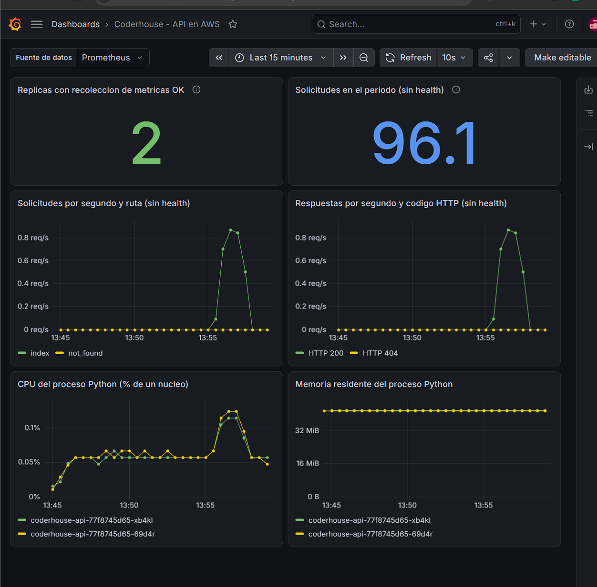
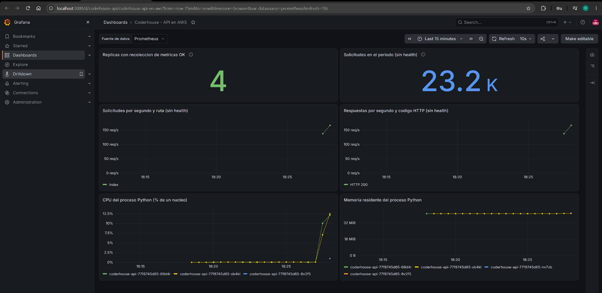
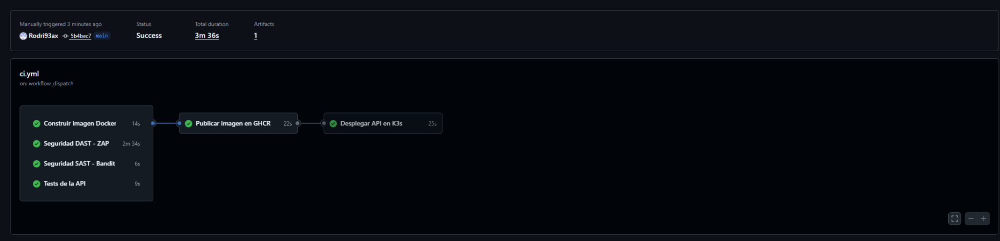

# Proyecto final DevOps - Rodrigo Arrocha

CODERHOUSE / DEVOPS

Pipeline CI/CDde una API en AWS

Infraestructura como código, despliegue en Kubernetes,seguridad y observabilidad.

| AUTOR | ENTREGA |
| --- | --- |
| Rodrigo Arrocha | 3 de octubre de 2026 |

Informe técnico del proyecto final

El proyecto integra una API Flask, una imagen Docker multi-stage, infraestructura AWS definida con Terraform y un pipeline que valida, publica y despliega mediante GitHub Actions. Las evidencias muestran despliegue saludable, métricas disponibles y autoescalado bajo carga.

github.com/Rodri93ax/proyecto-final-coderhouse

Base de revisión: ZIP del repositorio, commit b52c116580bb687ea2bc0c081da27ade6b895505. Evidencias del 26/09 al 03/10/2026. La disponibilidad en vivo depende del estado de la instancia.

PROYECTO FINAL / 01

Objetivo y cumplimiento de la consigna

## Objetivo y cumplimiento de la consigna

El objetivo fue construir un flujo completo desde el código hasta una aplicación operativa en AWS, con controles que impidan publicar una versión que no apruebe las pruebas funcionales y de seguridad. La solución se implementó como laboratorio reproducible y se documentó con archivos versionados, salidas de comandos y capturas reales.

| Requisito | Implementación | Evidencia principal |
| --- | --- | --- |
| Docker optimizado | Dos etapas, imagen slim, usuario no root y healthcheck. | Dockerfile; ghcr-local.txt |
| Terraform modular | Módulos network y compute; backend S3; IAM de EC2. | terraform-apply.txt; terraform-github-import.txt |
| CI/CD | Tests, build, SAST, DAST, GHCR y deploy SSM. | ci.yml; captura de seis jobs aprobados |
| Kubernetes | Deployment, Service, Ingress y HPA. | k8s/app.yaml; k8s-deploy.txt |
| Monitoreo | Prometheus Operator, PodMonitor y Grafana. | monitoring-install.txt; capturas del dashboard |
| FinOps | Recursos acotados, HPA y apagado manual. | hpa-prueba.txt; hpa-final.txt |
| Documentación | README, guía AWS, índice y este informe. | README.md; docs/reproduccion-aws.md |

Resultado verificado

La ejecución CI/CD documentada terminó correctamente: seis jobs aprobados, imagen identificada por commit, comando SSM exitoso, Deployment con 2/2 réplicas disponibles y respuesta {"status":"ok"}. Tras incorporar IAM a Terraform, el último plan aportado no encontró diferencias.

Alcance de la automatización

El pipeline de aplicación se dispara con cambios en main, pull requests y ejecución manual. El provisionamiento se ejecuta mediante workflows manuales de plan/apply. El bucket del estado y la federación OIDC se preparan antes; el monitoreo se instala con un script versionado. Esta separación refleja el funcionamiento real del proyecto.

Evidencia y código: docs/evidencias/INDICE.md; .github/workflows/; README.md.

PROYECTO FINAL / 02

Arquitectura y decisiones técnicas

## Arquitectura y decisiones técnicas

| Componente | Configuración del laboratorio |
| --- | --- |
| Cómputo | EC2 t3.large; Ubuntu 24.04; K3s v1.35.8+k3s1; un nodo. |
| Red AWS | VPC 10.42.0.0/16; subred 10.42.1.0/24; Internet Gateway y ruta de salida. |
| Red Kubernetes | Pods 10.52.0.0/16; servicios 10.43.0.0/16. Rangos separados de la VPC. |
| Acceso | HTTP 80 público para la API; SSH 22 limitado a ADMIN_CIDR /32; gestión por SSM. |
| Persistencia | EBS gp3 cifrado de 30 GiB; PVC local-path para Prometheus y Grafana. |
| Identidad | OIDC de GitHub hacia AWS; perfil IAM de EC2 para SSM; GITHUB_TOKEN para GHCR. |

Se eligió K3s para concentrar la práctica de Kubernetes en una instancia y reducir la complejidad operativa del laboratorio. Traefik resuelve el ingreso HTTP y el Service distribuye las solicitudes entre pods. El HPA modifica réplicas de la API; no crea nodos ni instancias EC2.

La IP pública es dinámica. La observada en el apply del 03/10 fue 100.54.24.213; debe consultarse de nuevo después de detener e iniciar la instancia. La dirección privada que figura en el Ingress no representa el endpoint público.

Evidencia y código: infra/modules/network/main.tf; infra/modules/compute/; k8s/app.yaml; monitoring/values.yaml.

PROYECTO FINAL / 03

Aplicación y Dockerfile multi-stage

## Aplicación y Dockerfile multi-stage

La API expone tres rutas: / devuelve información del proyecto, /health confirma salud y /metrics publica métricas Prometheus. El contador app_requests_total incluye endpoint y código HTTP. Se excluye el scrape de /metrics para no contabilizarse a sí mismo.

```
FROM python:3.14-slim AS builder

WORKDIR /build
COPY requirements.txt .
RUN python -m venv /opt/venv \
    && /opt/venv/bin/pip install --no-cache-dir -r requirements.txt

FROM python:3.14-slim AS runtime

ENV PATH="/opt/venv/bin:$PATH" \
    PYTHONDONTWRITEBYTECODE=1 \
    PYTHONUNBUFFERED=1

RUN groupadd --gid 10001 app \
    && useradd --uid 10001 --gid app --no-create-home app

WORKDIR /app
COPY --from=builder /opt/venv /opt/venv
COPY app.py .

USER 10001:10001
EXPOSE 8000

HEALTHCHECK --interval=30s --timeout=3s --start-period=10s --retries=3 \
    CMD python -c "import urllib.request; urllib.request.urlopen('http://127.0.0.1:8000/health', timeout=2)"

CMD ["gunicorn", "--bind", "0.0.0.0:8000", \
     "--workers", "1", "--threads", "4", \
     "--access-logfile", "-", "--error-logfile", "-", "app:app"]
```

La etapa builder instala dependencias fijadas dentro de /opt/venv. La etapa runtime copia ese entorno y la aplicación, evita la caché de pip y ejecuta con UID/GID 10001. Gunicorn utiliza un worker con cuatro threads; esta decisión es consistente con un contador en memoria por proceso. El escalado se realiza aumentando pods.

El healthcheck comprueba /health. En Kubernetes se usan además probes de inicio, disponibilidad y vida. La base python:3.14-slim no está fijada por digest; el diseño reduce componentes innecesarios, pero no se midió una reducción porcentual de tamaño ni se afirma reproducibilidad binaria.

Evidencia y código: Dockerfile; app.py; requirements.txt; docs/evidencias/ghcr-local.txt.

PROYECTO FINAL / 04

Infraestructura como código

## Infraestructura como código

Terraform se organiza en dos módulos. network crea la VPC, subred, Internet Gateway, tabla de rutas y asociación. compute crea la clave SSH pública, Security Group, EC2 y los recursos IAM de SSM. El módulo raíz conecta sus outputs y expone instance_id, public_ip y app_url.

```
module "compute" {
  source = "./modules/compute"
  project_name  = var.project_name
  vpc_id        = module.network.vpc_id
  subnet_id     = module.network.subnet_id
  admin_cidr    = var.admin_cidr
  public_key    = file(pathexpand(var.public_key_path))
  instance_type = var.instance_type
  k3s_version   = var.k3s_version
  depends_on   = [module.network]
}
```

| Decisión | Motivo y efecto |
| --- | --- |
| AMI fijada por ID | Evita que most_recent seleccione otra imagen al planificar. El ID es regional. |
| Variables de entrada | Permiten cambiar región, nombre, CIDR, clave, tipo de instancia y versión K3s. |
| EBS cifrado / IMDSv2 | Cifrado del disco y tokens obligatorios para metadata. |
| Bootstrap K3s | Instala la versión elegida, define el CIDR de pods y cifra secretos de K3s. |
| Lockfile del provider | Versión efectiva AWS 6.66.0; init de CI usa -lockfile=readonly. |
| Tags | Project, Environment y ManagedBy identifican los recursos del laboratorio. |

Estado remoto y operación

El backend S3 utiliza cifrado y bloqueo nativo con use_lockfile. Su bucket se prepara fuera de los módulos. El workflow apply genera un plan guardado, verifica que no incluya eliminación ni reemplazo y aplica ese mismo archivo. Las ejecuciones de apply se serializan con concurrency.

Cambiar el bootstrap puede reemplazar la EC2 porque user_data_replace_on_change está habilitado. En una prueba con la instancia detenida apareció una propuesta de reemplazo por la IP pública; desapareció al iniciarla. Por eso se revisan los planes con la instancia encendida y no se acepta una sustitución inesperada.

Evidencia y código: infra/; .github/workflows/terraform-plan.yml; .github/workflows/terraform-apply.yml.

PROYECTO FINAL / 05

Identidad, SSM e importación de IAM

## Identidad, SSM e importación de IAM

GitHub solicita un token OIDC y asume el rol github-coderhouse-deploy. La confianza limita la audiencia a sts.amazonaws.com y el subject al repositorio y rama main. Se evita almacenar credenciales AWS permanentes en GitHub. La guía de réplica explica la adaptación del subject, incluidos los IDs inmutables cuando correspondan [R1].

| Identidad / recurso | Responsabilidad |
| --- | --- |
| Rol federado de GitHub | Consultar/provisionar infraestructura, acceder al estado y ejecutar Run Command en la instancia elegida. |
| Rol coderhouse-ec2-ssm | Permitir que EC2 use Systems Manager mediante AmazonSSMManagedInstanceCore. |
| Instance profile de EC2 | Asociar el rol SSM a la instancia desde Terraform. |
| GITHUB_TOKEN | Publicar la imagen en GHCR con packages: write. |
| Secret grafana-admin | Credenciales de Grafana generadas durante la instalación del monitoreo. |

Incorporación de recursos existentes

El rol, el perfil y su asociación de política se habían creado para habilitar SSM. Se añadieron sus bloques resource a compute/iam.tf y bloques import en el módulo raíz. El apply incorporó los objetos existentes al estado y ajustó etiquetas y descripción sin destruir la instancia.

```
Apply complete!
Resources: 3 imported, 0 added, 2 changed, 0 destroyed.

Plan posterior:
No changes. Your infrastructure matches the configuration.
```

El ZIP conserva infra/imports.tf como registro de esa adopción. En una réplica sin esos objetos se debe desactivar ese archivo y permitir que Terraform los cree. Mantener bloques import es válido para el entorno ya importado; no convierte esos IDs en recursos que existan en cualquier cuenta [R2].

SSM requiere agente instalado y activo, permisos del perfil y conectividad de salida. El bootstrap no instala explícitamente el agente: la guía incluye su verificación y el procedimiento de instalación en Ubuntu si falta [R3].

Evidencia y código: infra/modules/compute/iam.tf; infra/imports.tf; terraform-github-import.txt; terraform-plan-final.txt.

PROYECTO FINAL / 06

Pipeline: del commit al despliegue

## Pipeline: del commit al despliegue

| Etapa | Ejecución y condición |
| --- | --- |
| Tests | Python 3.14; cinco pruebas unittest de rutas, métricas y cabeceras. |
| Build | Construcción Docker independiente para validar el Dockerfile. |
| SAST | Bandit 1.9.4 analiza app.py y tests/. |
| DAST | API temporal en runner; ZAP Baseline analiza /, /health y /metrics. |
| Publicación | Espera tests, build, SAST y DAST. Solo main y eventos distintos de pull_request. |
| Despliegue | Espera publish; comprueba EC2 running y SSM Online; aplica manifiestos y verifica salud. |

Los primeros cuatro jobs se ejecutan en paralelo. El job publish construye la imagen de publicación, añade etiquetas de repositorio y revisión y la sube a GHCR con el SHA completo del commit. El job deploy reemplaza la referencia de imagen del manifiesto en memoria por ese SHA y lo transmite en un comando SSM.

La etiqueta SHA facilita trazabilidad. El build del job de validación y el de publicación son construcciones separadas; el pipeline no promociona un único artefacto por digest. La documentación conserva esta distinción.

Criterio de éxito del despliegue

```
k3s kubectl apply -f "$DEPLOY_DIR/app.yaml"
k3s kubectl -n coderhouse rollout status \
  deployment/coderhouse-api --timeout=300s
k3s kubectl -n coderhouse get deployment,pods,svc,ingress,hpa
curl --retry 12 --retry-all-errors --retry-delay 2 \
  --retry-max-time 60 --max-time 10 -fsS \
  http://127.0.0.1/health
```

El workflow espera el resultado de Run Command y exige estado Success con ResponseCode 0. Un error de rollout o healthcheck hace fallar el job. Los despliegues comparten un grupo de concurrencia. No se implementó rollback automático; el README documenta recuperación manual.

Los informes DAST se adjuntan como artifacts incluso si el análisis falla, con retención de 30 días. Las evidencias relevantes también están versionadas en docs/evidencias/.

Evidencia y código: .github/workflows/ci.yml; docs/evidencias/deploy-github-ssm.txt.

PROYECTO FINAL / 07

Seguridad: hallazgos y remediación

## Seguridad: hallazgos y remediación

La primera evaluación ZAP detectó ausencia de cabeceras y una observación de caché. Se corrigió la aplicación y se incorporaron pruebas de regresión sobre respuestas 200 y 404. La misma imagen de ZAP se fija por digest para comparar las ejecuciones.

| Control | Resultado inicial | Resultado posterior |
| --- | --- | --- |
| CSP | Cabecera ausente; riesgo medio | Política restrictiva definida |
| X-Content-Type-Options | Cabecera ausente | nosniff |
| Permissions-Policy | Cabecera ausente | Cámara, micrófono y geolocalización deshabilitados |
| Cross-Origin-Resource-Policy | Ausente o inválida | same-origin |
| Caché | Contenido almacenable | no-store; alerta informativa aceptada |
| Resumen ZAP | 62 PASS / 5 WARN / 0 FAIL | 66 PASS / 1 WARN / 0 FAIL |

Regla que bloquea la publicación

```
accepted = (
    str(alert.get("alertRef")) == "10049-1"
    and str(alert.get("riskcode")) == "0"
)
# Cualquier alerta distinta se agrega a blocked.
if blocked:
    raise SystemExit(1)
```

La alerta Non-Storable Content permanece visible: corresponde a Cache-Control: no-store, una decisión de diseño. El control no considera aprobados todos los warnings de ZAP: permite solo ese identificador con riesgo informativo. También rechaza informes sin sitios analizados y errores del scanner.

Defensa en varias capas

Bandit revisa patrones de riesgo en Python; ZAP evalúa el comportamiento HTTP de la API; los tests verifican las cabeceras. Docker y Kubernetes ejecutan sin root, los pods tienen filesystem de solo lectura y capacidades eliminadas, y AWS requiere IMDSv2. Ninguno de estos controles constituye por sí solo una garantía de ausencia de vulnerabilidades.

El DAST se realiza contra un contenedor temporal del runner. La evidencia deploy-security.txt comprueba que las cabeceras corregidas también estaban presentes en la versión desplegada. No se implementó escaneo de CVE de dependencias o de la imagen.

Evidencia y código: security/check_zap.py; tests/test_security_headers.py; zap-inicial/; zap-final/; deploy-security.txt.

PROYECTO FINAL / 08

Kubernetes: servicio y autoescalado

## Kubernetes: servicio y autoescalado

k8s/app.yaml agrupa cinco recursos: Namespace coderhouse, Deployment coderhouse-api, Service ClusterIP, Ingress Traefik y HorizontalPodAutoscaler. Los pods se seleccionan por la etiqueta app: coderhouse-api. El Service atiende en 80 y dirige tráfico al puerto http del contenedor, 8000.

| Configuración | Valor / finalidad |
| --- | --- |
| Réplicas y revisiones | 2 réplicas iniciales; 3 revisiones para historial del Deployment. |
| Requests | 100m CPU / 128 MiB por pod. |
| Limits | 500m CPU / 256 MiB por pod. |
| Probes | Startup, readiness y liveness consultan /health. |
| Identidad | UID/GID 10001; no root; token de ServiceAccount sin montaje automático. |
| Aislamiento del contenedor | Sin elevación de privilegios, capabilities ALL eliminadas y seccomp RuntimeDefault. |
| Escritura temporal | Filesystem raíz de solo lectura; emptyDir de 64 MiB en /tmp. |

```
apiVersion: autoscaling/v2
kind: HorizontalPodAutoscaler
metadata:
  name: coderhouse-api
  namespace: coderhouse
spec:
  scaleTargetRef:
    apiVersion: apps/v1
    kind: Deployment
    name: coderhouse-api
  minReplicas: 2
  maxReplicas: 4
  metrics:
    - type: Resource
      resource:
        name: cpu
        target:
          type: Utilization
          averageUtilization: 70
```

El porcentaje de CPU se calcula respecto del request de cada pod; por eso puede superar 100%. Las métricas del HPA provienen de la API de métricas de recursos de Kubernetes. Prometheus cumple otra función: observabilidad de la aplicación y del nodo.

Evidencia y código: k8s/app.yaml; docs/evidencias/k8s-metricas.txt; hpa-final.txt.

PROYECTO FINAL / 09

Prometheus y Grafana

## Prometheus y Grafana

El script install-monitoring.sh instala kube-prometheus-stack 91.4.0 en monitoring. Crea un Secret de administración si no existe, aplica values.yaml y registra el PodMonitor. El dashboard se suministra como JSON y como ConfigMap; este último debe aplicarse después de instalar el stack.

| Elemento | Configuración |
| --- | --- |
| PodMonitor | Selecciona app=coderhouse-api en namespace coderhouse; /metrics en puerto http cada 15 segundos. |
| Prometheus | Scrape global de 30 s; retención 1 día / 2 GB; PVC de 5 GiB. |
| Grafana | Servicio ClusterIP; sin Ingress público; PVC de 1 GiB; contraseña en Secret. |
| Dashboard | Targets activos, solicitudes, códigos HTTP, CPU y memoria del proceso Python. |
| Acceso | Port-forward de Kubernetes y túnel SSH o SSM desde la computadora del operador. |

Consultas utilizadas

```
sum(up{namespace="coderhouse",
       job="monitoring/coderhouse-api"})

sum by (exported_endpoint) (
  rate(app_requests_total{namespace="coderhouse",
    exported_endpoint!="health"}[$__rate_interval])
)

sum(increase(app_requests_total{namespace="coderhouse",
  exported_endpoint!="health"}[$__range]))
```

Las consultas excluyen /health para separar el tráfico de la aplicación de las sondas. La etiqueta exported_endpoint contiene el endpoint original después de su conflicto con la etiqueta del scrape. El contador no se incrementa por consultar /metrics.

El total basado en increase() es una estimación del intervalo y puede contener decimales. La captura de la siguiente página muestra 96.1 después de la prueba de tráfico; el log del generador registra 100 solicitudes. No se interpreta esa diferencia como pérdida de solicitudes.

Los PVC usan local-path sobre el nodo. No aportan redundancia frente a pérdida del disco o terminación de EC2. El monitoreo detallado de EC2 deshabilitado en Terraform es independiente de Prometheus, que sí está instalado.

Evidencia y código: monitoring/values.yaml; api-podmonitor.yaml; dashboard.json; scripts/; monitoring-install.txt.

PROYECTO FINAL / 10

Evidencia visual de observabilidad

## Evidencia visual de observabilidad



Figura 1. Dashboard real del laboratorio, aportado por el autor (27/09/2026). Se observan dos réplicas con scrape correcto, actividad HTTP y curvas de CPU y memoria. El panel excluye las solicitudes de salud.

El dashboard permite relacionar tráfico y consumo por pod. La evidencia respalda que Prometheus recolectó métricas de la API y que Grafana las visualizó; no representa una medición actual del servicio ni una garantía de disponibilidad continua.

Evidencia y código: docs/evidencias/capturas/grafana-api.png; trafico-api.txt; monitoring/dashboard.json.

PROYECTO FINAL / 11

Prueba de carga y comportamiento del HPA

## Prueba de carga y comportamiento del HPA

La prueba registrada ejecutó 16 clientes durante 180 segundos y completó 81.443 solicitudes exitosas, sin errores reportados por el generador. El seguimiento del HPA mostró un aumento desde dos hasta cuatro réplicas y el retorno gradual a dos al finalizar la carga.



Figura 2. Dashboard durante carga: cuatro targets activos y aumento de solicitudes y CPU. La ventana de Grafana y el total del generador no son mediciones equivalentes.

| Fase | Lectura observada | Réplicas |
| --- | --- | --- |
| Reposo inicial | CPU 1% / objetivo 70% | 2 |
| Inicio de carga | CPU 386% / objetivo 70% | 2 antes de escalar |
| Escalado | CPU 336% / objetivo 70% | 4 |
| Retiro de carga | CPU desciende a 1% | 4 durante estabilización |
| Retorno | Eventos SuccessfulRescale | 3 y luego 2 |

Los logs incluyen avisos iniciales de métricas no disponibles y luego eventos de escalado exitoso. Se conserva ese contexto: el resultado final muestra ScalingActive=True y 2 réplicas deseadas. La prueba demuestra adaptación en este entorno; no determina capacidad máxima ni un SLA.

Evidencia y código: hpa-carga.txt; hpa-prueba.txt; hpa-final.txt; capturas/grafana-hpa-carga.png.

PROYECTO FINAL / 12

Evidencia del pipeline y despliegue

## Evidencia del pipeline y despliegue



Figura 3. Ejecución manual del CI/CD del 02/10/2026, commit 5b4bec7: seis jobs aprobados, duración total 3m36s. El deploy terminó en 25s.

```
Comando SSM: f2afe7fe-ad1f-4dea-a1d5-43ef08cc1950
Estado SSM: Success

deployment "coderhouse-api" successfully rolled out
Deployment: READY 2/2, UP-TO-DATE 2, AVAILABLE 2
Pods: 2 Running, 0 reinicios en la salida registrada
HPA: CPU 1%/70%, MINPODS 2, MAXPODS 4, REPLICAS 2
{"status":"ok"}
```

El log identifica la imagen publicada con el SHA completo 5b4bec77111ad68919fe0f8e7f20a01e1b6b9dab. Los recursos aparecen unchanged porque el manifiesto ya estaba aplicado; aun así se verifica el rollout y el healthcheck. Esto demuestra una ejecución válida sobre el estado existente, no una nueva creación del clúster.

Verificación final de Terraform

El 03/10 se importaron el rol SSM, el perfil y la asociación de política. El apply final reportó tres importaciones, dos actualizaciones y cero destrucciones. La transcripción posterior proporcionada por el autor muestra:

```
No changes. Your infrastructure matches the configuration.
```

La instancia final conservó el ID i-0125cbf96588912aa. Los archivos históricos muestran una EC2 anterior y varias IP públicas; esas diferencias están identificadas como etapas previas y no se mezclan con los resultados finales.

Evidencia y código: deploy-github-ssm.txt; capturas/ci-cd-success.png; terraform-github-import.txt; terraform-plan-final.txt.

PROYECTO FINAL / 13

Reproducción local y del entorno AWS

## Reproducción local y del entorno AWS

Validación local

```
git clone https://github.com/Rodri93ax/proyecto-final-coderhouse.git
cd proyecto-final-coderhouse
python3.14 -m venv .venv
source .venv/bin/activate
python -m pip install -r requirements.txt
python -m unittest discover -s tests -v

docker build -t coderhouse-api:local .
docker run -d --name coderhouse-api-local \
  -p 127.0.0.1:8000:8000 coderhouse-api:local
curl -fsS http://127.0.0.1:8000/health
```

Secuencia para otra cuenta o laboratorio

| Paso | Acción |
| --- | --- |
| 1. Preparar | Instalar Git, Docker, Python 3.14, Terraform 1.16.4 y AWS CLI. Autenticar una identidad autorizada. |
| 2. Bootstrap | Crear bucket de estado privado, con versionado y cifrado. Preparar proveedor OIDC y rol GitHub. |
| 3. Adaptar | Cambiar cuenta, bucket, rol, subject, región/AMI, clave pública y ADMIN_CIDR. Revisar imports.tf. |
| 4. Provisionar | Ejecutar init, validate, plan y aplicar el plan revisado. Esperar K3s Ready y SSM Online. |
| 5. Conectar CI/CD | Actualizar INSTANCE_ID y el permiso SSM. En un fork adaptar GHCR y la regex del deploy. |
| 6. Desplegar | Ejecutar CI/CD en main y comprobar rollout, pods y /health. |
| 7. Observar | Instalar Helm y monitoreo, aplicar el ConfigMap del dashboard y generar tráfico. |

El README contiene los comandos completos de ejecución, validación y operación. docs/reproduccion-aws.md desarrolla los prerrequisitos externos a Terraform, con plantillas IAM en docs/iam/. Los valores de la cuenta original sirven como referencia, no como credenciales o permisos transferibles.

En el entorno original ya importado no se requiere repetir las importaciones. En un entorno vacío se desactiva imports.tf para que los bloques resource creen IAM. La réplica completa desde cero no se volvió a ejecutar durante la preparación de esta documentación.

Evidencia y código: README.md; docs/reproduccion-aws.md; docs/iam/.

PROYECTO FINAL / 14

Operación, recuperación y FinOps

## Operación, recuperación y FinOps

Comprobación operativa en EC2

```
sudo systemctl is-active k3s
sudo k3s kubectl get nodes
sudo k3s kubectl -n coderhouse get deployment,pods,svc,ingress,hpa
sudo k3s kubectl -n coderhouse top pods
curl -fsS --max-time 10 http://127.0.0.1/health
```

El resultado esperado es nodo Ready, Deployment disponible, pods Running, HPA con CPU numérica y salud ok. Los mensajes  del HPA durante el arranque deben reevaluarse cuando Metrics Server y los pods estén listos. Ante un rollout fallido se revisan describe, eventos y logs antes de modificar recursos.

Recuperación de una versión

```
sudo k3s kubectl -n coderhouse rollout history \
  deployment/coderhouse-api
sudo k3s kubectl -n coderhouse rollout undo \
  deployment/coderhouse-api
sudo k3s kubectl -n coderhouse rollout status \
  deployment/coderhouse-api --timeout=300s
```

Es un procedimiento documentado, sin evidencia de ejecución de rollback. El siguiente CI vuelve a desplegar su commit; por eso una corrección duradera debe quedar también en Git. No hay reversión automática por fallo de salud.

Uso de recursos y apagado

| Medida | Alcance real |
| --- | --- |
| HPA de 2 a 4 pods | Adapta capacidad de la aplicación dentro de una EC2; no reduce su tarifa por sí solo. |
| Requests y limits | Acotan reservas y consumo de los contenedores. |
| Créditos standard / monitoreo básico | Evita el modo unlimited de CPU; monitoring=false en EC2. |
| Retención de métricas | Prometheus limitado a 1 día / 2 GB. |
| Apagado manual | Detener EC2 al terminar, después de los workflows. El EBS persiste y puede seguir generando cargos. |

Al retomar se inicia la instancia, se espera SSM Online y K3s Ready y se consulta la IP nueva. No se usa Terminate para pausar el laboratorio. No se implementó apagado programado ni se calculó un ahorro monetario; la práctica FinOps demostrada es el control operativo del consumo.

Evidencia y código: README.md, secciones HPA/FinOps y recuperación; infra/modules/compute/main.tf; monitoring/values.yaml.

PROYECTO FINAL / 15

Trazabilidad y evolución del proyecto

## Trazabilidad y evolución del proyecto

El trabajo se construyó de forma incremental. Los commits y las evidencias permiten identificar el paso de una API local a un despliegue automatizado con seguridad y monitoreo. La siguiente selección corresponde al historial compartido y a referencias presentes en los logs.

| Commit / referencia | Hito |
| --- | --- |
| 737022e | Automatización inicial de tests y build Docker. |
| f0a37dd | Análisis estático con Bandit. |
| 1f14f90 | Publicación en GHCR tras tests y SAST; imagen probada localmente. |
| cff0d30 | Infraestructura AWS con Terraform y despliegue inicial en K3s. |
| bd3e23b | Prometheus, Grafana y dashboard de la API. |
| 13b0607 | Documentación de prueba de autoescalado. |
| 633d1a6 | Cabeceras de seguridad corregidas tras el DAST. |
| bf7483d | Reintentos del healthcheck; ejecución CI 36353724830 aprobada. |
| b2e61b1 | Migración del estado Terraform a S3 con bloqueo. |
| 5b4bec7 | Versión identificada en la evidencia de CI/CD y despliegue por SSM. |
| b52c116 | Snapshot del ZIP revisado para este informe. |

Incidentes y decisiones documentadas

Se corrigió el solapamiento entre la red de pods y la VPC, quedando cluster-cidr en 10.52.0.0/16. El log terraform-fix-network.txt conserva el reemplazo de la EC2 inicial. Esa operación histórica es distinta del último apply de IAM, que no destruyó recursos.

Se añadieron reintentos al healthcheck para tolerar el arranque del contenedor, se remediaron cabeceras a partir de los informes ZAP y se incorporaron los recursos IAM creados previamente a la gestión de Terraform. El plan final sin cambios cierra esa última sincronización.

Los artifacts de GitHub tienen retención finita. Los logs y reportes seleccionados se conservan en el repositorio para que el evaluador pueda revisarlos incluso si el laboratorio está detenido.

Evidencia y código: Historial aportado; docs/evidencias/; commit del ZIP. Los enlaces de ejecución están en el índice de evidencias.

PROYECTO FINAL / 16

Validación, límites y referencias

## Validación, límites y referencias

Validación de la entrega

Se revisaron los archivos del ZIP contra la consigna, los logs y las capturas aportadas. Como comprobación complementaria se instalaron las dependencias fijadas en un entorno aislado con Python 3.12 y pasaron los cinco tests existentes. El proyecto usa Python 3.14 en CI/Docker; esta prueba local adicional no sustituye esa evidencia.

También se verificó sintaxis Python y Bash y se ejecutó el evaluador DAST sobre los informes guardados: rechazó el inicial y aceptó el final y los tres informes de rutas de CI. No se ejecutaron nuevas operaciones AWS ni un nuevo build Docker durante la redacción. El código operativo del ZIP se mantuvo sin cambios.

Límites explícitos

El laboratorio tiene un solo nodo, HTTP público y almacenamiento local. No ofrece alta disponibilidad, TLS, backups automáticos, rollback automático, escaneo de CVE ni apagado programado. La imagen base y las acciones usan etiquetas de versión; fijarlas por digest/SHA sería una mejora de reproducibilidad. El bucket y el rol OIDC requieren bootstrap externo. Estos límites no se presentan como funcionalidades completadas.

Material que acompaña el informe

README con ejecución local y de pruebas, guía de AWS y GitHub, plantillas IAM, índice de evidencias, capturas y este PDF. El repositorio contiene los Dockerfiles, módulos Terraform, workflows, manifiestos Kubernetes y archivos de monitoreo completos. El texto fuente del informe se incluye como docs/informe-fuente.md.

Referencias

[R1] GitHub Docs. OIDC con AWS: audiencia, subject y permisos del workflow. Consultar documentación oficial.

[R2] HashiCorp. Importación de recursos existentes y bloques import. Consultar documentación oficial.

[R3] AWS Systems Manager. Instalación de SSM Agent en Ubuntu con Snap. Consultar documentación oficial.

[R4] Evidencia CI: ejecución 36353724830. Evidencia OIDC: ejecución 36355746346.

[R5] Código completo: snapshot b52c116 del repositorio. Archivos de evidencia y rutas específicas: docs/evidencias/INDICE.md.

Las fuentes principales de los resultados son el código y las evidencias del autor. Las referencias oficiales apoyan los procedimientos de réplica; no certifican el estado del laboratorio.
